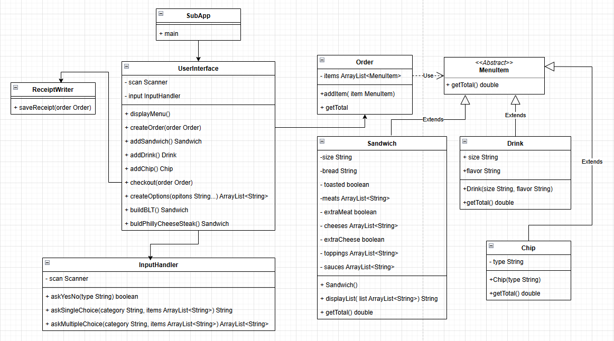

# DELI-CIOUS SUB
##  Sandwich Ordering Application

A simple, modular Java console application that allows users to create and manage sandwich orders.  
The project demonstrates object-oriented design principles such as abstraction, inheritance.

---

##  Project Structure
```
com.pluralsight
|--- SubApp.java # Application entry point
│
|--- ui
│ |--- UserInterface.java # Main menu and user interactions
│ |--- InputHandler.java # Handles all user input operations
│
|--- model
│ |--- MenuItem.java # Abstract base class for all menu items
│ |--- Sandwich.java # Represents a customizable sandwich
│ |--- Drink.java # Represents a drink item
│ |--- Chip.java # Represents a chip item
│ |--- Order.java # Holds all ordered items and calculates totals
│
|--- repository
| |--- ReceiptWriter.java # Saves the order details as a receipt text file

```


---

## Features
- Main Menu
```
1) New order
0) exit
```
- Order Menu
```
1) Add Sandwich
2) Add Drink
3) Add Chips
4) Checkout
0) Cancel Order
```
- Sandwich Menu
```
1) BLT
  Large Toasted White Bread
  Bacon
  Cheddar Cheese
  Lettuce, Tomato
  Ranch
2) Philly Cheese Steak
  Large Toasted White Bread
  Steak
  American Cheese
  Peppers
  Mayo
3) Build Your Sandwich
```
- Checkout Menu
```
1) Confirm
2) Cancel
```
---

##  How It Works

1. The application starts with the `SubApp` main class.  
2. The user can create a new order via the console menu.  
3. The `UserInterface` guides the user to:
   - Build a sandwich (choose bread, meats, cheese, toppings, sauces, etc.)
   - Add drinks or chips
   - Confirm or cancel the order
4. When confirmed, `ReceiptWriter` saves a timestamped `.txt` receipt.

---

## UML Diagram

